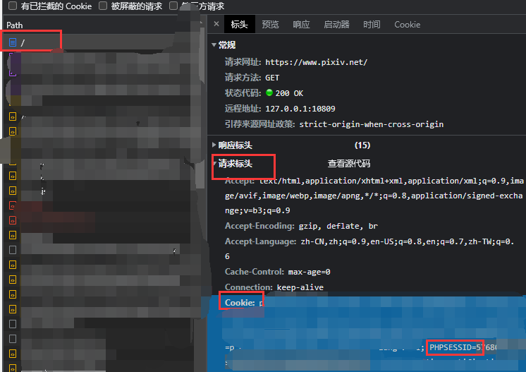

# Pixiv本地UI - Pixiv-Local-UI

## 功能

### 基础功能

#### 绘画

1. 最新关注
2. 搜索
3. 详情
4. 喜欢、收藏、取消收藏
5. 发现
6. 评论区显示、发言
7. 推荐作品
8. 用户的：插画、漫画、小说、收藏、约稿 （todo）

#### 小说

1. 最新关注
2. 搜索
3. 详情
4. 喜欢、收藏、取消收藏
5. 发现（todo）
6. 评论区显示、发言
7. 小说系列

### 可配置功能

1. 在搜索结果中将已收藏的作品分组显示
2. 按照一定规则屏蔽作品（分组显示），现有规则为有4种：`uid`、`用户名关键字`、`作品标题关键字`、`标签`

## 部署方法

1. 本项目基于 [Pixiv-Nginx](https://github.com/mashirozx/Pixiv-Nginx) 实现，需要部署在它里面。`Pixiv-Nginx`自己的部署方法见：[这里](https://2heng.xin/2017/09/19/pixiv/)
2. 从[Releases](https://github.com/AgMonk/px_local_ui/releases)里下载UI包，或自己编译源码，放入`pixiv-nginx/plu`目录，确保`index.html`文件处于该根目录下
3. 下载配置文件 [plu.conf](https://github.com/AgMonk/px_local_ui/blob/master/plu.conf)，放入`pixiv-nginx/conf`目录，用记事本打开该目录中的`nginx.conf`文件，在`include pixiv.conf;`
   后面新起一行，写`include plu.conf;` （注意分号不要丢）
4. 回到`pixiv-nginx`目录，启动`nginx.exe`；如果之前已经启动，点地址栏输入`cmd`回车，会打开命令行，输入`nginx -s reload`重启nginx
5. 用浏览器打开`http://localhost:8082/`，能看到界面说明部署成功

## 配置文件`plu.conf`

可能需要修改的地方

1. 端口，默认`8082`，如果已经占用则需要修改
2. aria2的映射路径，默认为`http://localhost:6800/jsonrpc`，如果你的`Aria2`不在这里则需要修改

## 登陆

1. 本UI使用`PHPSESSID`间接登陆，请先确保你已经在官方站登陆
2. 浏览器打开一个新标签，按F12打开控制台，切换到`网络`标签
3. 打开`https://www.pixiv.net/`，点击`网络`标签出现的第一个请求，在`请求标头` 的`Cookie`项中找到一段以`PHPSESSID`开头的字符串，复制等号后面分号之前的内容，即为登陆需要的`PHPSESSID`

