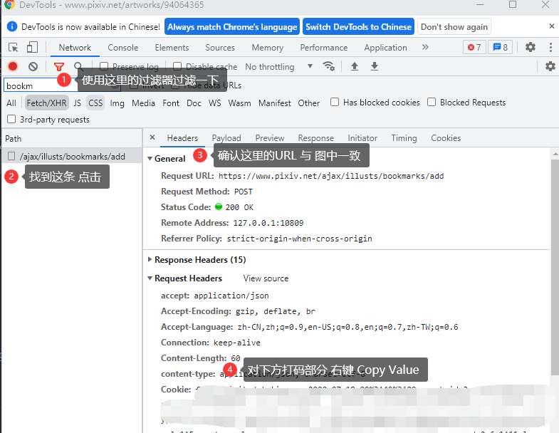

# Pixiv本地UI - Pixiv-Local-UI

## 适用人群

1. 使用该链接中的 Pixiv-Nginx方案 上Pixiv的桶子 : https://2heng.xin/2017/09/19/pixiv/
2. Pixiv本站的UI加载速度慢，图片加载速度慢的桶子

## 已有功能

1. 关注作者的作品，作者关注、取关
2. 搜索、发现
3. 作品详情查看，评论区查看，收藏、取消收藏；如果你使用了Aria2，可以一键下载原图
4. 根据uid、用户名关键字或作品标题关键字从搜索结果中屏蔽作品

## 特色功能

1. 默认使用 带佬的反代 `pixiv.re` 加载图片，速度一般要比Pixiv本站快不少；不过为了降低带佬服务器压力，本UI限制了请求并发数；
2. 作品搜索结果（包括关注、搜索、用户作品）界面的左上会显示本次搜索结果的作品上传的时间跨度；及当前还未加载缩略图的作品数量；搜索结果中，已收藏和按照屏蔽规则被屏蔽的作品不会直接显示在主界面上，可以点击上方的 “已收藏” 或 “已屏蔽” 按钮查看。
3. 已获取过作品详细信息的作品，在搜索结果中会在左下角显示其收藏数；配置中可以选择在展示搜索结果时直接获取作品的详细信息，但是这会减慢搜索结果的加载速度。
4. 请求搜索结果和作品详情时，如果等待时间超过20秒则会放弃并自动重新请求
5. 作品搜索结果和作品详情数据都使用了缓存机制，短时间内再次访问不会再向Pixiv本站请求数据；所以推荐只用单个浏览器标签使用本UI，也不要使用浏览器的刷新功能刷新页面，请使用界面上提供的刷新按钮

## 准备工作

### 部署

1. 在 nginx 文件夹下，新建文件夹命名为 `plu `

2. 到 releases 里下载最新版已打包好的 zip ，解压到该文件夹中，确保 `index.html` 位于 `plu` 的根目录下

3. 用记事本或其他文本编辑器打开 `nginx/conf/nginx.conf` 文件，在最后一个 } 前 添加如下配置：

   ```nginx
   server {
           listen       8082;
           server_name  localhost;
   
           location / {
               root   plu;
               index  index.html index.htm;
               try_files $uri $uri/ /index.html;
           }
           location ^~ /pixiv-net/ {
               proxy_pass https://www.pixiv.net/;
               proxy_set_header referer https://www.pixiv.net/;
           }
           location ^~ /pximg/ {
               proxy_pass https://i.pximg.net/;
               proxy_set_header referer https://i.pximg.net/;
           }
           location ^~ /pxre/ {
               proxy_ssl_server_name on;
               proxy_ssl_protocols TLSv1 TLSv1.1 TLSv1.2;
               proxy_pass https://i.pixiv.re/;
               proxy_set_header referer https://i.pixiv.re/;
           }
            # aira2路径
           location ^~ /aria2 {
               proxy_pass http://localhost:6800/jsonrpc;
          }
           error_page   500 502 503 504  /50x.html;
           location = /50x.html {
               root   html;
           }
       }
   ```

   (该文件里应该已有其他的 `server {xxxxx}` 他们的位置应该是平行的)

4. 启动 `nginx.exe`，如果之前已经启动，需要使用 cmd 命令行 到 nginx 文件夹下 执行该命令重启 让配置生效 : `nginx.exe -s reload`，如果你使用 `PowerShell`，则需要执行的命令为 ：`.\nginx.exe -s reload`，如果成功不会有任何报错或返回消息。

5. 用浏览器打开 http://localhost:8082 ，看到界面则表示以上步骤执行正确。

### 配置

使用之前需要从浏览器中获取 cookie 和 token ，以chrome为例，其他浏览器大同小异，界面有可能是中文，自行对应

打开任一一个未收藏的图片 格式形如: pixiv.net/artworks/xxxxxxxx

1. 按F12打开控制台，点击“Network”或“网络”，`点击收藏按钮`之后按图操作，拿到cookie

   

2. 然后拉到最低下 对 “x-csrf-token” 执行图中最后一步操作，拿到 token

3. 到http://localhost:8082/config 中设置这两个。一次设置的有效时间为30天。

4. 配置完成

